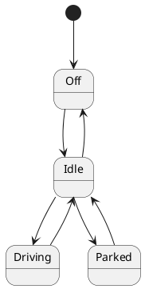

# UML Car Modeling Project

This project focuses on modeling a car using PlantUML state diagrams. The goal is to represent the various components, states, and transitions of a car in a structured and visual manner.

## Project Overview

The project uses PlantUML to create state diagrams that depict the behavior of a car. The diagrams will help visualize the car's components, their valid states, and the transitions between these states.

## Components and States

Below is the JSON representation of the car's components, states, and transitions:

```json
{
    "Car": {
        "states": [
            "Off",
            "Idle",
            "Driving",
            "Parked"
        ],
        "transitions": {
            "Off": ["Idle"],
            "Idle": ["Driving", "Parked", "Off"],
            "Driving": ["Idle"],
            "Parked": ["Idle"]
        }
    },
    "Engine": {
        "states": [
            "Off",
            "On"
        ],
        "transitions": {
            "Off": ["On"],
            "On": ["Off"]
        }
    },
    "Doors": {
        "states": [
            "Locked",
            "Unlocked"
        ],
        "transitions": {
            "Locked": ["Unlocked"],
            "Unlocked": ["Locked"]
        }
    },
    "FuelSystem": {
        "states": [
            "Empty",
            "Low",
            "Full"
        ],
        "transitions": {
            "Empty": ["Low"],
            "Low": ["Full", "Empty"],
            "Full": ["Low"]
        }
    }
}
```

## How to Use

1. Install [PlantUML](https://plantuml.com/) to generate state diagrams.
2. Use the JSON structure above to create PlantUML diagrams for each component.
3. Visualize the car's behavior and transitions using the generated diagrams.

## Example PlantUML Syntax

Here is an example of how to represent the `Car` component in PlantUML:



## Conclusion

This project provides a structured approach to modeling a car's behavior using state diagrams. By following the JSON structure and PlantUML syntax, you can create detailed visualizations of the car's components and their interactions.